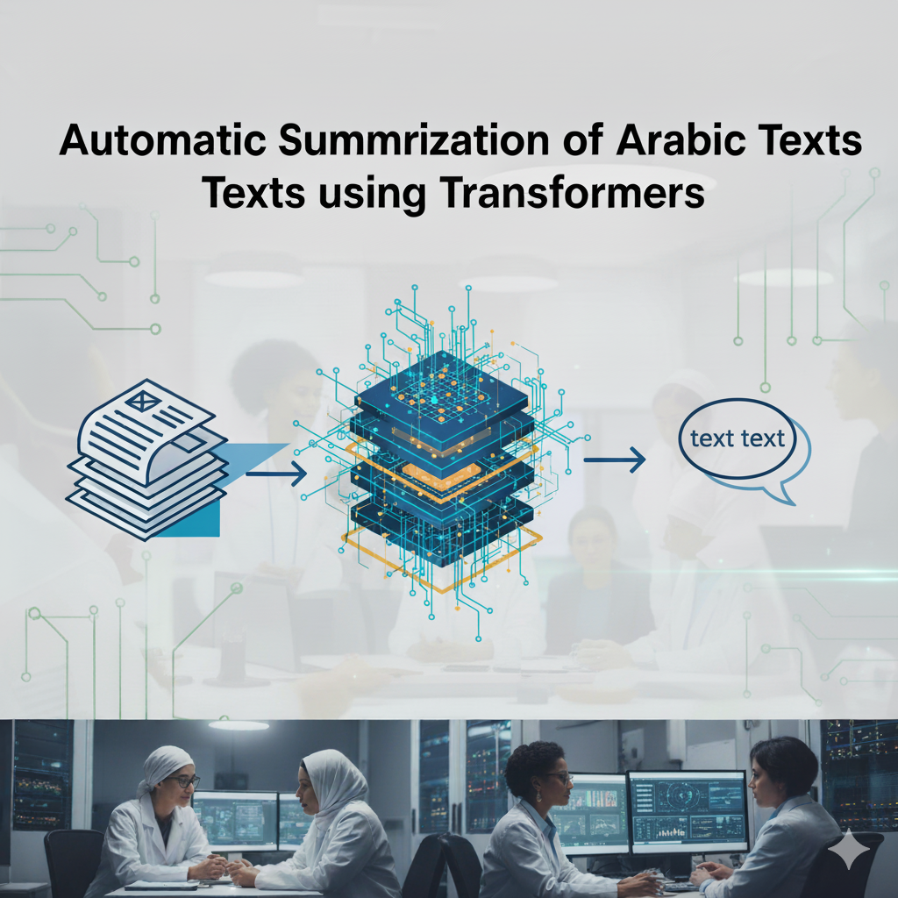
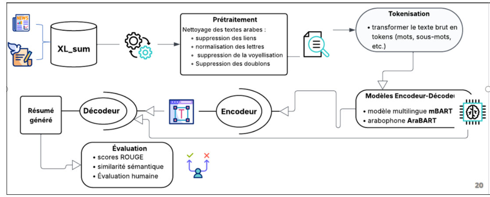

#  Automatic Summarization of Arabic Texts using Transformers




##  Table of Contents
- [Overview](#overview)
- [Project Pipeline](#project-pipeline)
- [Dataset](#dataset-xl-sum-arabic-subset)
- [Preprocessing](#preprocessing-pipeline)
- [Model: AraBART](#️-model-arabart)
- [Model: mBART](#model-2-mbart)
- [Evaluation Results](#evaluation-results)
- [Results](#results)
- [Usage](#usage)


##  Overview
This project addresses **automatic abstractive summarization of Arabic texts** using Transformer-based models.  
The goal is to generate **concise, coherent summaries** of long Arabic news articles, leveraging the **XL-Sum dataset** and fine-tuning the **AraBART** model and **Mbart**.  

The work contributes to the underexplored field of **Arabic NLP**, where resources are scarce compared to English, and demonstrates that modern Transformers can effectively handle Arabic’s morphological and syntactic richness.

---
## Project Pipeline
 


##  Dataset: XL-Sum (Arabic Subset)
- **Source:** BBC Arabic news articles  
- **Task type:** Abstractive summarization (single-sentence summaries)  
- **Format:** Each entry contains two fields → `text` (article body) & `summary` (gold summary)  
- **Language:** Arabic only (dataset also available in 44 other languages)  

###  Exploratory Data Analysis
- **Article length:** Most between 1,000–3,000 characters, with some outliers > 40,000 characters.  
- **Summary length:** Mostly 150–250 characters (one-sentence abstractive summaries).  
- This makes XL-Sum highly suitable for **short abstractive summarization** tasks.  

---

##  Preprocessing Pipeline
To improve data quality before training, a custom Arabic preprocessing pipeline was built:

| Step | Description |
|------|-------------|
| **Duplicate removal** | Remove repeated entries |
| **delete_links** | Remove hyperlinks |
| **delete_repeated_characters** | Normalize repeated punctuation/letters |
| **remove_extra_spaces** | Keep only valid Arabic words |
| **replace_letters** | Normalize similar Arabic letters |
| **clean_text** | Remove non-Arabic / non-numeric characters |
| **remove_vowelization** | Strip diacritics |
| **delete_stopwords** | Remove Arabic + English stopwords |
| **stem_text** | Apply ISRI Arabic stemmer |
| **text_prepare** | Master function orchestrating all steps |

---
## ⚙️ Model: AraBART
We fine-tuned **Jezia/AraBART-finetuned-wiki-ar** on XL-Sum Arabic.

### Tokenization
- **Input text:** Truncated/padded to **1000 tokens**  
- **Summaries:** Truncated/padded to **400 tokens**  
- **Pad tokens** replaced with `-100` to ignore during loss computation  
- **Attention masks** used to focus only on relevant tokens  

### Training Configuration
| Hyperparameter        | Value |
|------------------------|-------|
| Pretrained model       | Jezia/AraBART-finetuned-wiki-ar |
| Optimizer             | AdamW |
| Learning rate         | 1e-4 |
| Batch size            | 2 |
| Max input length      | 1000 |
| Max summary length    | 400 |
| Epochs                | 3 |
| Decoding              | Beam Search (5 beams) |
| Repetition penalty    | 1.0 |
| Length penalty        | 0.8 |
| Evaluation metrics    | ROUGE-L, Semantic similarity (SBERT) |
| Hardware              | Kaggle GPU (CUDA) |

Training was conducted with **PyTorch Lightning**, using `trainer.fit()` for efficient optimization.

---

##  Evaluation Results
Two evaluation metrics were used:

- **ROUGE-L** → measures lexical overlap between generated and reference summaries  
- **Semantic Similarity** → cosine similarity of embeddings (Sentence-BERT)  

### Results (AraBART)
- **ROUGE-L:** Most scores between **0.15 and 0.40**  
- **Semantic similarity:** Concentrated between **0.90 and 1.0**


  

###  Model 2: mBART
- **Pretrained model:** `facebook/mbart-large-50-many-to-many-mmt`  
- **Tokenizer:** MBartTokenizerFast with `ar_AR` as source & target language  
- **Input length:** 512 tokens  
- **Summary length:** 128 tokens  
- **Training framework:** Hugging Face `Trainer`  
- **Decoding:** Beam Search (5), repetition penalty = 1.0, length penalty = 0.8  

**Hyperparameters**
| Param                | Value |
|----------------------|-------|
| Learning rate        | 5e-5 (default Trainer) |
| Batch size           | 4 |
| Epochs               | 3 |
| Optimizer            | AdamW |
| Evaluation           | ROUGE-1, ROUGE-2, ROUGE-L, Semantic similarity |

---

##  Results

| Model   | ROUGE-L | Semantic Similarity | Notes |
|---------|---------|----------------------|-------|
| AraBART | 0.15–0.40 (avg ~0.27) | 0.90–1.0 | Strong semantic preservation, concise summaries |
| mBART   | Lower overall ROUGE-L | ~0.92    | Multilingual, but less fluent in Arabic style |

✅ **Conclusion:** AraBART generates more accurate and natural Arabic summaries compared to mBART, which sometimes produces longer or redundant sentences.  

---


##  Usage

### Clone the repository
```bash
git clone https://github.com/your-username/arabic-text-summarization-transformers.git
cd arabic-text-summarization-transformers
```
---
### Install dependencies
```bash
pip install -r requirements.txt
```


